##  一、项目需求分析

对学生成绩信息进行管理的系统。

实现的功能：

- 用户管理功能：

  - 登陆功能

  - 注册功能

  - 用户分为管理员、普通用户两个角色，拥有不同的权限

- 成绩数据管理功能：

  - 管理员可以查看、添加、删除、修改学生成绩信息

  - 普通用户页面只有查看功能

## 二、系统总体设计

#### 一、数据库设计：

  账号数据表（）：

  |列名|列名说明|数据类型|长度|主码或外码|
|-|-|-|-|-|
|uid|用户登陆的账号|int||主码|
|pwd|账号登陆对应的密码|varchar|20||
|type|账号类型（管理员/学生）|varchar|20||

  信息数据库：

  |列名|列名说明|数据类型|长度|主码或外码|
|-|-|-|-|-|
|sno|学生的学号|int||主码|
|sname|学生的名字|varchar|20||
|sex|学生性别|char|4||
|age|学生年龄|int|20||
|grades|学生成绩（1~100）|int|||

  ```SQL
CREATE DATABASE studentManager;
USE studentManager;
create table login
(
    uid  int                        not null
        primary key,
    pwd  varchar(20)                not null,
    type varchar(20) default '学生' not null,
    check (`type` in ('管理员','学生'))
);

create table student
(
    sno    int            not null
        primary key,
    sname  varchar(20)    not null,
    sex    char(4)        null,
    age    int default 20 null,
    grades int            null,
    check (`grades` between 1 and 100)
);


INSERT INTO student VALUES(1001,'张三','男',20,'19875636161');
INSERT INTO student VALUES(1002,'李四','女',19,'18723357543');
INSERT INTO student VALUES(1003,'王五','男',21,'13445467823');
INSERT INTO student VALUES(1004,'赵六','男',19,'16456568900');
INSERT INTO student VALUES(1005,'刘二','男',19,'13453546666');

INSERT INTO student VALUES(1006,'小明','男',21,'12434569345');
INSERT INTO student VALUES(1007,'小王','男',20,'12192334572');
INSERT INTO student VALUES(1008,'小天','男',20,'15556468843');
INSERT INTO student VALUES(1009,'小美','女',20,'13454655679');
INSERT INTO student VALUES(1010,'小月','女',20,'14649087635');

INSERT INTO student VALUES(1011,'小汪','男',19,'13586739043');
INSERT INTO student VALUES(1012,'兔兔','女',19,'12445463506');
INSERT INTO student VALUES(1013,'小李','男',21,'13545467343');


INSERT INTO login VALUES(1, '1234','管理员');
INSERT INTO login(uid, pwd) VALUES(2, '2222');
INSERT INTO login(uid, pwd) VALUES(3, '6666');

  ```

### 二、前端设计：

  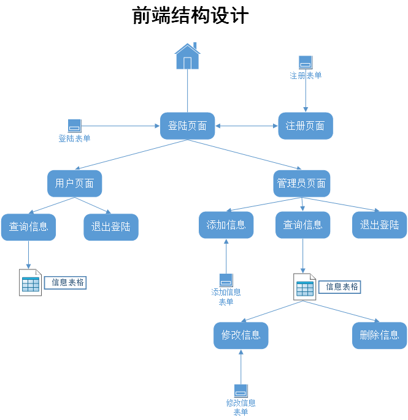

### 三、后端设计：

  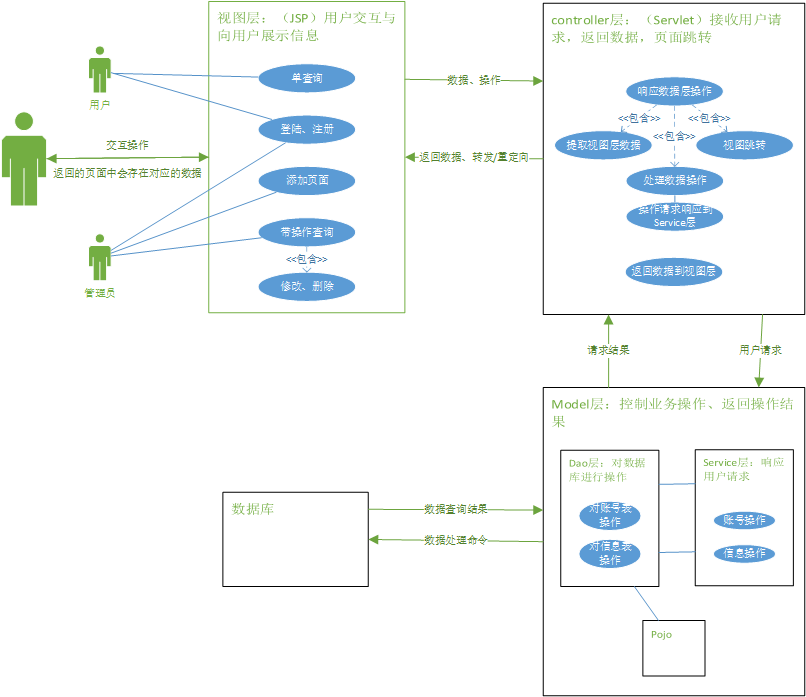

## 三、系统详细设计

### 一、登陆功能： 

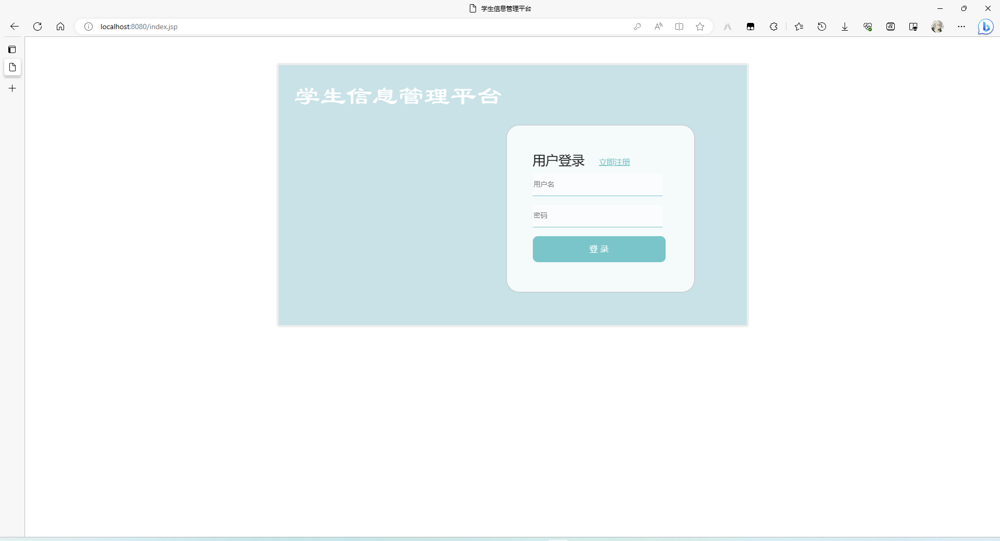

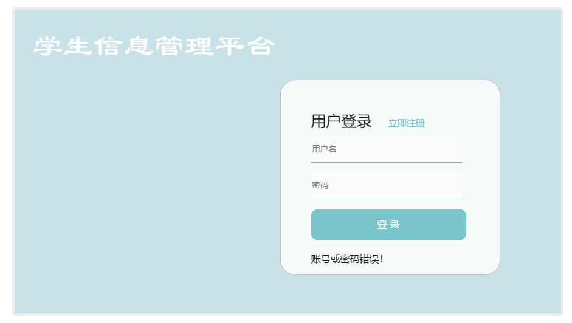

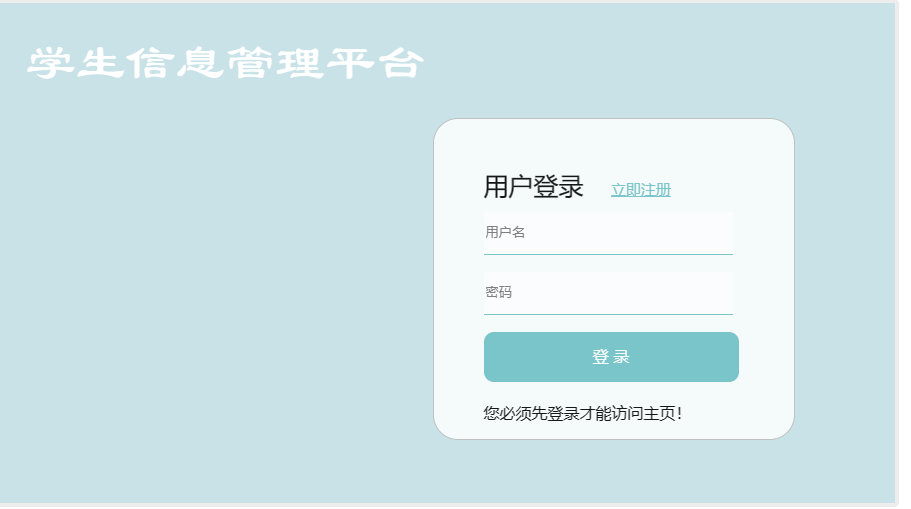


- 页面代码


```html
<form action="LoginServlet" method="post">
    <div class="loginDiv">
        <div class="name">
            用户登录 <a href="register.jsp"> 立即注册</a>
        </div>

        <div class=item>
            <input type="text" name="uid" placeholder="用户名"/>
        </div>
        <div class=item>
            <input type="password" name="pwd" placeholder="密码"/>
        </div>
        <input type="submit" class="login-btn" value="登 录"/>
        <%
            if(session.getAttribute("loginErrorMessage") != null){

                String loginErrorMessage = (String)session.getAttribute("loginErrorMessage");
                out.print(loginErrorMessage);
            }
        %>
        <%
            String register = (String) request.getAttribute("register");
            if (register!= null) {
                if (register.equals("reg")) {
                    out.println("注册成功, 请登录！");
                }
            }
        %>
        <%
            if(session.getAttribute("pwdError") != null){

                String pwdError = (String)session.getAttribute("pwdError");
                out.print(pwdError);
            }
        %>
    </div>
</form>
```
 提供一个表单供用户输入账号信息，表单提交响应到LoginServlet调用post方法。表单下方有存在session的信息提示：第一个信息为未登录就自己访问功能菜单页面会提示这个错误信息。第二个信息为注册成功之后返回登陆页面的提示。第三个信息为密码错误的提示。

- 后端处理逻辑以及主要代码

```java
protected void doPost(HttpServletRequest request, HttpServletResponse response) throws ServletException, IOException {

        StudentService service = new StudentServiceImpl();
        HttpSession session = request.getSession();

        if (session.getAttribute("loginErrorMessage") != null) {
            session.invalidate();
        }
        String uid = request.getParameter("uid");
        String pwd = request.getParameter("pwd");
        System.out.println(uid);
        System.out.println(pwd);

        if (uid!=null && !pwd.equals(""))
        {
            int _uid = Integer.parseInt(uid);
            boolean result = service.login(_uid, pwd);
            boolean type = service.type(_uid, pwd);

            if (result) {

                if (type) {
                    session.setAttribute("login", "type0");
                    response.sendRedirect("main.jsp");
                } else {
                    session.setAttribute("login", "type1");
                    response.sendRedirect("main1.jsp");
                }
            } else {
                System.out.println("账号或密码错误！");
                session.setAttribute("pwdError","账号或密码错误！");
                response.sendRedirect("index.jsp");
            }
        }
        else {
            response.sendRedirect("index.jsp");
        }
    }

}
```

 重置Session，获取表单信息，判断输入是否为空，为空不予操作，重定向回页面。根据输入的账号密码调用Service.login查询账号、Service.type查询账号权限，当账号匹配时登陆成功，根据权限类型进入不同的菜单页面，错误时设置登陆错误的Session信息，重定向到当前页面。

  ```Java
public boolean login(int uid, String pwd) {
        return dao.login(uid, pwd);
    }
  ```

  ```Java
public boolean Type(int uid, String pwd) {
        try {
            Class.forName(DBTools.DRIVER_CLASS);// 加载驱动

            conn = DriverManager.getConnection(DBTools.CONN_STR, DBTools.USRENAME, DBTools.PWD);
            st = conn.createStatement();

            int count = 0;
            String sqlStr = "select type from login where uid =" + uid + " and pwd = '" + pwd + "'";

            rs = st.executeQuery(sqlStr);
            if (rs.next()) {
                String type=rs.getString(1);
                if (Objects.equals(type, "管理员"))
                {
                    count=1;
                }
            }
            if(count>0)
                return true;
            else
                return false;

        }
        catch (ClassNotFoundException e) {
            e.printStackTrace();
        }
        catch (SQLException e) {
            e.printStackTrace();
        }
        return false;
    }
  ```

  ```Java
public boolean login(int uid, String pwd) {

        try {
            Class.forName(DBTools.DRIVER_CLASS);
            conn = DriverManager.getConnection(DBTools.CONN_STR, DBTools.USRENAME, DBTools.PWD);
            st = conn.createStatement();

            int count = 0;
            String sqlStr = "select * from login where uid =" + uid + " and pwd = '" + pwd + "'";

            rs = st.executeQuery(sqlStr);
            while(rs.next()) {
                count++;
            }
            if(count>0)
                return true;
            else
                return false;

        } catch (ClassNotFoundException e) {
            e.printStackTrace();
        } catch (SQLException e) {
            e.printStackTrace();
        }
        return false;
    }
  ```

  Dao层使用jdbc对数据库操作。Login()配置环境、加载驱动，创建语句对象用以执行sql语句，以账号密码查询，查询到即返回true。

  Type()同样以账号密码查询账户的type列值（默认为“学生”），当值为管理员时返回true值

### 二、注册功能：

  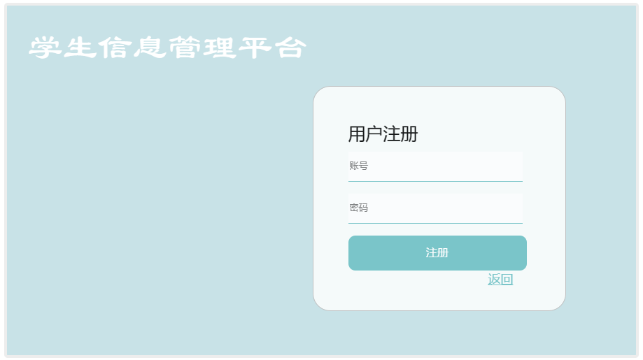

  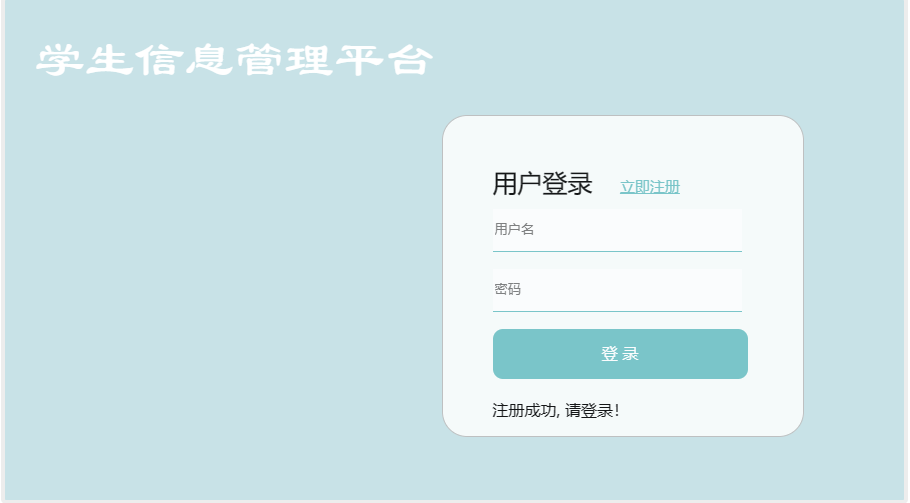

  ```HTML
    <form action = "RegisterServlet">
    <div class = "registerDiv">
      <div class = "name">用户注册</div>
      <div class = "item">
        <input type = "text" name = "uid" placeholder="账号"/>
      </div>
      <div class = "item">
        <input type = "password" name = "pwd"  placeholder="密码"/>
      </div>
      <input type = "submit" class = "btn" value = "注册"/>
      <a href = "index.jsp" >返回</a>
    </div>
   </form>
  ```

  提供一个表单供用户输入要注册的账户信息

  ```java
protected void doPost(HttpServletRequest request, HttpServletResponse response) throws ServletException, IOException 
{

        StudentService service = new StudentServiceImpl();
        String uid = request.getParameter("uid");
        String pwd = request.getParameter("pwd");
        int _uid = Integer.parseInt(uid);
        boolean result = service.addLogin(_uid,pwd);

        if(!result) {
            request.setAttribute("register", "reg");
            request.getRequestDispatcher("index.jsp").forward(request, response);
        }else {
            request.getRequestDispatcher("register.jsp").forward(request, response);
        }

}
  ```

  ```Java
public int addStudent(Student student) {
        return dao.addStudent(student);
    }
  ```

  ```Java
public boolean addLogin(int uid, String pwd) {
        try {
            Class.forName(DBTools.DRIVER_CLASS);// 加载驱动

            conn = DriverManager.getConnection(DBTools.CONN_STR, DBTools.USRENAME, DBTools.PWD);
            st = conn.createStatement();
            String sqlStr = "insert into login (uid, pwd) values(" + uid + ",'" + pwd + "')";
            System.out.println(sqlStr);
            int result = st.executeUpdate(sqlStr);
        } catch (ClassNotFoundException e) {
            e.printStackTrace();
        } catch (SQLException e) {
            e.printStackTrace();
        }
        return false;
    }
  ```
获取表单中的账号密码，插入到数据库的login表中，插入成功会保存一个信息，重定向到登陆页面，并显示注册成功的信息；插入失败则重定向回注册页面。


### 三、成绩信息查询：

- 管理员查询页面带修改、删除（功能）

  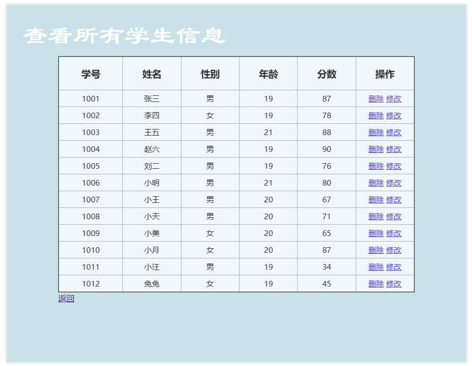

  ```HTML
  <%
        List<Student> allStudents = (List<Student>)session.getAttribute("allStudents");
        for (int i = 0; i < allStudents.size(); i++) {
          Student s  = allStudents.get(i);
      %>
      <tr>
        <td><%=s.getSno() %></td>
        <td><%=s.getSname() %></td>
        <td><%=s.getSex() %></td>
        <td><%=s.getAge() %></td>
        <td><%=s.getgrades() %></td>
        <td>
          <a href = "DeleteServlet?sno=<%=s.getSno() %>">删除</a>
          <a href = "QueryStudentBySnoServlet?sno=<%=s.getSno()%>">修改</a>
        </td>
      </tr>
      <%
        }
      %>


​			获取后端搜索到并存储在Session中的学生信息list，再通过循环的方式，设置到前端的表格上，数据末尾有删除和修改的事务链接


  ```Java
@WebServlet("/ShowAllStudentsServlet")
public class ShowAllStudentsServlet extends HttpServlet{

    @Override
    protected void doGet(HttpServletRequest request, HttpServletResponse response) throws ServletException, IOException {
        StudentService service = new StudentServiceImpl();
        HttpSession  session =   request.getSession();
      
        List<Student> allStudents = service.getAllStudents();
        session.setAttribute("allStudents", allStudents);
        response.sendRedirect("showAllStudents.jsp");
    }

}
  ```

  ```Java
public List<Student> getAllStudents() {
        return dao.getAllStudents();
    }
  ```

  ```Java
@Override
    public List<Student> getAllStudents() {
        try {
            Class.forName(DBTools.DRIVER_CLASS);
            conn = DriverManager.getConnection(DBTools.CONN_STR, DBTools.USRENAME, DBTools.PWD);
            
            st = conn.createStatement();

            String sqlStr = "select * from student";

            rs = st.executeQuery(sqlStr);

            List<Student> allStudents = new ArrayList<Student>();

            while (rs.next()) {
                int _sno = rs.getInt(1);
                String _sname = rs.getString(2);
                String _sex = rs.getString(3);
                int _age = rs.getInt(4);
                int _grades = rs.getInt(5);
                Student s = new Student(_sno, _sname, _sex, _age, _grades);
                allStudents.add(s);
            }

            return allStudents;

        } catch (ClassNotFoundException e) {
            e.printStackTrace();
        } catch (SQLException e) {
            e.printStackTrace();
        }

        return null;
    }
  ```

  编写了查询所有数据的方法，获得一个学生数据list，将学生数据list存入session中的"allStudent"属性中，重定向到前端查询页面中

- 查询结果分页显示

  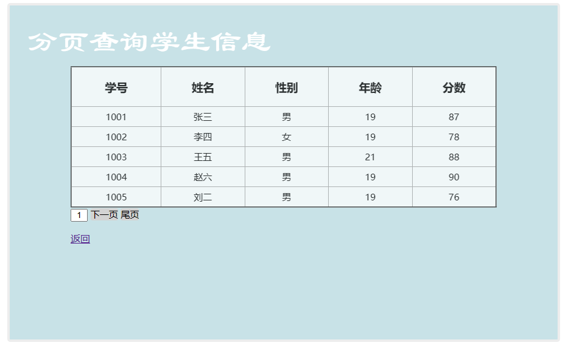

  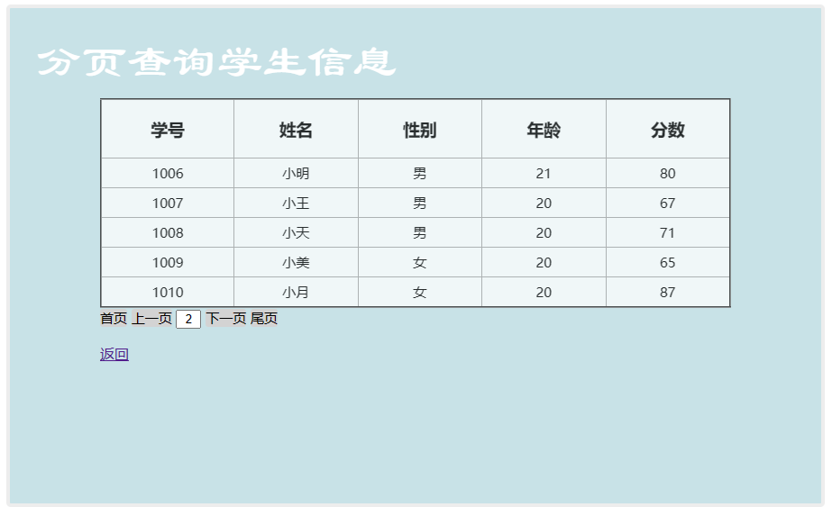

  ```HTML
<body>
<div class="mainDiv">
    <div class="titleDiv">分页查询学生信息</div>
    <div class = "showStudentDiv">
        <table  border="2" cellspacing="0">
            <tr>
                <th><h3>学号</h3></th>
                <th><h3>姓名</h3></th>
                <th><h3>性别</h3></th>
                <th><h3>年龄</h3></th>
                <th><h3>分数</h3></th>
</tr>
        <%
            Page page1 = (Page)request.getAttribute("page1");

```html
        for(Student student:page1.getStudent()){

    %>
    <tr>
        <td><%=student.getSno() %></td>
        <td><%=student.getSname() %></td>
        <td><%=student.getSex() %></td>
        <td><%=student.getAge() %></td>
        <td><%=student.getgrades() %></td>
    </tr>
    <%
        }
    %>
</table>

<%
    if(page1.getCurrentPage()==page1.getTotalPage()){
%>
<div class = item>
    <a href = "ShowStudentsByPageServlet?currentPage=0">首页</a>
    <a href = "ShowStudentsByPageServlet?currentPage=<%=page1.getCurrentPage()-1%>">上一页</a>
    <input type = "text" name = "currentPage" value="<%=page1.getTotalPage()+1%>"/>
</div>
<%
} else if(page1.getCurrentPage()==0){
%>
<div class = item>
    <input type = "text" name = "currentPage" value="1"/>
    <a href = "ShowStudentsByPageServlet?currentPage=<%=page1.getCurrentPage()+1%>">下一页</a>
    <a href = "ShowStudentsByPageServlet?currentPage=<%=page1.getTotalPage()%>">尾页</a>
</div>
<%
} else{
%>
<div class = item>
    <a href = "ShowStudentsByPageServlet?currentPage=0">首页</a>
    <a href = "ShowStudentsByPageServlet?currentPage=<%=page1.getCurrentPage()-1%>">上一页</a>
    <input type = "text" name = "currentPage" value="<%=page1.getCurrentPage()+1%>"/>
    <a href = "ShowStudentsByPageServlet?currentPage=<%=page1.getCurrentPage()+1%>">下一页</a>
    <a href = "ShowStudentsByPageServlet?currentPage=<%=page1.getTotalPage()%>">尾页</a>
</div>
<%
    }
%>

<a href = "main1.jsp">返回</a>
</div>
    </div>
</body>
```
设置表格展示数据，数据list由后端给出一页。首页即将当前页码（currentPage）设置为0，再调用事件。同理上一页为减1，下一页为加1，尾页即设置为总页数（TotalPage）。

```java
public class Page {
    private int currentPage;  //当前页面
    private int pageSize;     //一页有多少条数据
    private int totalCount;   //一共有多少条数据
    private int totalPage;    //一共有多少页
    private List<Student> student;
    public Page() {

    }
    public Page(int currentPage, int pageSize, int totalCount, int totalPage, List<Student> student) {
        this.currentPage = currentPage;
        this.pageSize = pageSize;
        this.totalCount = totalCount;
        this.totalPage = totalPage;
        this.student = student;
    }

    public int getCurrentPage() {
        return currentPage;
    }

    public void setCurrentPage(int currentPage) {
        this.currentPage = currentPage;
    }

    public int getPageSize() {
        return pageSize;
    }

    public void setPageSize(int pageSize) {
        this.pageSize = pageSize;
    }

    public int getTotalCount() {
        return totalCount;
    }

    public void setTotalCount(int totalCount) {
        this.totalCount = totalCount;
    }

    public int getTotalPage() {
        return totalPage;
    }

    public void setTotalPage(int totalPage) {
        this.totalPage = totalPage;
    }

    public List<Student> getStudent() {
        return student;
    }

    public void setStudent(List<Student> student) {
        this.student = student;
    }
}
```

  ```Java
@WebServlet("/ShowStudentsByPageServlet")
public class ShowStudentsByPageServlet extends HttpServlet{

    @Override
    protected void doGet(HttpServletRequest request, HttpServletResponse response) throws ServletException, IOException {
        StudentService Service = new StudentServiceImpl();
        int count = Service.getTotalCount();

        Page page = new Page();


        String currentPage = request.getParameter("currentPage");

        if(currentPage == null) {
            currentPage = "0";
        }
        int _currentPage = Integer.parseInt(currentPage);
        page.setCurrentPage(_currentPage);

        int totalCount = Service.getTotalCount();
        page.setTotalCount(totalCount);


        int pageSize = 5;
        int totalPage = (totalCount / pageSize) + 1;
        page.setTotalPage(totalPage+1);


        page.setPageSize(pageSize);

        List<Student> student = Service.queryStudentsByPageNo(_currentPage, pageSize);
        page.setStudent(student);

        request.setAttribute("page1", page);
        request.getRequestDispatcher("showAllStudentsByPageNo.jsp").forward(request, response);
    }

}
  ```

  ```Java
@Override
    public List<Student> queryStudentsByPageNo(int current, int pageSize) {
        return dao.queryStudentByPage(current,pageSize);
    }
 @Override
    public int getTotalCount() {
        return dao.getTotalCount();
    }
  ```

  ```Java
 public List<Student> queryStudentByPage(int current, int pageSize) {
        try {
            Class.forName(DBTools.DRIVER_CLASS);

            conn = DriverManager.getConnection(DBTools.CONN_STR, DBTools.USRENAME, DBTools.PWD);
            
            st = conn.createStatement();

            int startPosition = current * pageSize;

            String sqlStr = "select * from student limit " + startPosition + "," + pageSize;
            rs = st.executeQuery(sqlStr);
            List<Student> allStudents = new ArrayList<Student>();
            while (rs.next()) {
                int _sno = rs.getInt(1);
                String _sname = rs.getString(2);
                String _sex = rs.getString(3);
                int _age = rs.getInt(4);
                int _grades = rs.getInt(5);
                Student s = new Student(_sno, _sname, _sex, _age, _grades);
                allStudents.add(s);
            }
            return allStudents;
        } catch (ClassNotFoundException e) {
            e.printStackTrace();
        } catch (SQLException e) {
            e.printStackTrace();
        }

        return null;
    }

public int getTotalCount() {//查询总数据数

        try {
            Class.forName(DBTools.DRIVER_CLASS);

            conn = DriverManager.getConnection(DBTools.CONN_STR, DBTools.USRENAME, DBTools.PWD);

            st = conn.createStatement();
            String sql = "select count(*) from student";
            rs = st.executeQuery(sql);
            while (rs.next()){
                int totalCount = rs.getInt(1);
            }


        }catch (Exception e){
            e.printStackTrace();
        }
        return 0;
    }
  ```

  建立一个Page类用以设置页面的页数信息、数据信息。

  检测当前页是否为空，为空就设置为第一个页。获取数据总数，设置页总数（一页展示五条数据）。queryStudentsByPageNo(_currentPage, pageSize);搜索当前页码的五条数据。查询开始的位置由当前页码数（_currentPage）*页码大小（pageSize），即sql语句 `"select * from student limit " + startPosition + "," + pageSize`含义为从student表中选择所有的列，但是只返回从startPosition开始的pageSize条记录。

### 四、成绩信息添加：

  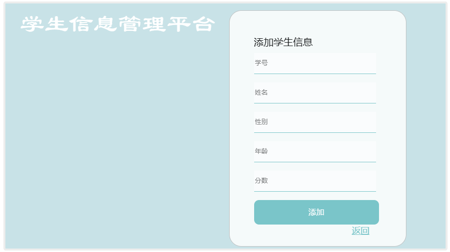

  ```HTML
<div class="mainDiv">
  <div class="titleDiv">学生信息管理平台</div>
  <form action = "AddServlet">
    <div class = "addDiv">
      <div class = "name">添加学生信息</div>

      <div class = "item">
        <input type = "text" name="sno" placeholder="学号"/>
      </div>
      <div class = "item">
        <input type = "text" name="sname" placeholder="姓名"/>
      </div>
      <div class = "item">
        <input type = "text" name="sex" placeholder="性别"/>
      </div>
      <div class = "item">
        <input type = "text" name="age" placeholder="年龄"/>
      </div>
      <div class = "item">
        <input type = "text" name="grades" placeholder="分数"/>
      </div>
      <input type = "submit" class = "btn" value = "添加"/>
      <a href = "main.jsp">返回</a>
    </div>
  </form>
</div>
  ```

  提供一个表单，供输入要添加的信息，条件响应AddServlet

  ```Java
@Override
    protected void doPost(HttpServletRequest request, HttpServletResponse response) throws ServletException, IOException {

        StudentService service = new StudentServiceImpl();
        String sno  = request.getParameter("sno");
        String sname  = request.getParameter("sname");
        String sex  = request.getParameter("sex");
        String age  = request.getParameter("age");
        String grades  = request.getParameter("grades");

        int _sno = 0;
        if(sno != null || "".equals(sno)){
            _sno = Integer.parseInt(sno);
        }

        int _age = 0;
        if (age !=null || "".equals(age)){
            _age = Integer.parseInt(age);
        }

        int _grades=0;
        if(grades!=null || "".equals(grades)){
            _grades=Integer.parseInt(grades);
        }

        Student s = new Student(_sno, sname, sex, _age, _grades);
        int result = service.addStudent(s);
        System.out.println(result+" 0为成功获取");
        HttpSession session = request.getSession();
        session.setAttribute("student", "stu");
        response.sendRedirect("main.jsp");

    }
  ```

  ```Java
@Override
    public int addStudent(Student student) {
        return dao.addStudent(student);
    }
  ```

  获取表单的内容，字符串类型转换成int，通过函数进行添加，添加成功后回到主页面

### 五、成绩信息修改：

  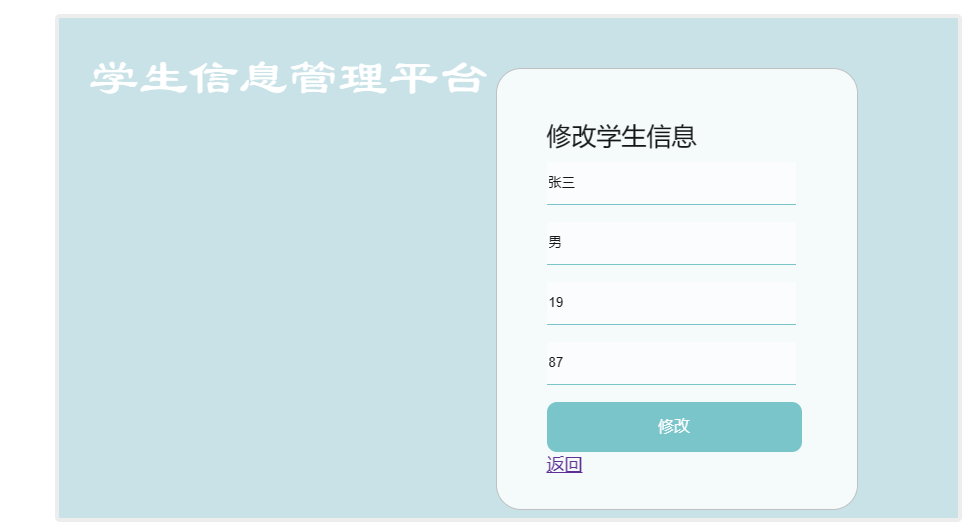

  ```HTML
<div class="mainDiv">
    <div class="titleDiv">学生信息管理平台</div>

    <form action = "UpdateServlet">
        <%
            Student s =(Student)request.getAttribute("student");
        %>
        <div class = "updateDiv">
            <div class = "name">修改学生信息</div>
            <input type="hidden" name="sno" value="<%=s.getSno()%>"/>
            <div class = "item">
                <input type = "text" name="sname" placeholder="姓名" value="<%=s.getSname()%>"/>
            </div>
            <div class = "item">
                <input type = "text" name="sex" placeholder="性别" value="<%=s.getSex()%>"/>
            </div>
            <div class = "item">
                <input type = "text" name="age" placeholder="年龄" value="<%=s.getAge()%>"/>
            </div>
            <div class = "item">
                <input type = "text" name="grades" placeholder="分数" value="<%=s.getgrades()%>"/>
            </div>
            <input type = "submit" class = "btn" value = "修改"/>
            <a href = "showAllStudents.jsp">返回</a>
        </div>
    </form>
    </div>
</div>
  ```

  获取查询页面对应查询到的学生信息，并填入表单，对表格信息修改提交后响应UpdateServlet

  ```Java
@WebServlet("/UpdateServlet")
public class UpdateServlet extends HttpServlet {

    protected void doGet(HttpServletRequest request, HttpServletResponse resp) throws ServletException, IOException {

        String sno = request .getParameter("sno");
        String sname  = request.getParameter("sname");
        String sex  = request.getParameter("sex");
        String age  = request.getParameter("age");
        String grades  = request.getParameter("grades");

        int _sno = 0;
        if(sno != null && !"".equals(sno)){
            _sno = Integer.parseInt(sno);
        }
        int _age = 0;
        if(age != null && !"".equals(age)){
            _age = Integer.parseInt(age);
        }
        int _grades=0;
        if(grades!=null && !"".equals(grades))
        {
            _grades=Integer.parseInt(grades);
        }


        Student stu = new Student(_sno, sname, sex, _age, _grades);

        StudentService service = new StudentServiceImpl();
        service.updateStudentBySno(_sno,stu);

        request.getRequestDispatcher("ShowAllStudentsServlet").forward(request, resp);

    }
}
  ```

  ```Java
   public int updateStudentBySno(int sno, Student stu) {
        return dao.updateStudentBySno(sno,stu);
    }
  ```

  ```Java
@Override
    public int updateStudentBySno(int sno, Student stu){
        try {
            Class.forName(DBTools.DRIVER_CLASS);
            conn = DriverManager.getConnection(DBTools.CONN_STR, DBTools.USRENAME, DBTools.PWD);
            st = conn.createStatement();

            String sql = "update student set sname= '"+stu.getSname()+"', sex='"+stu.getSex()+"', age="+stu.getAge()+", grades='"+stu.getgrades()+"' where sno="+sno;
          System.out.println(sql);
            int result = st.executeUpdate(sql);

        } catch (Exception e){
            e.printStackTrace();
        }
        return 0;
    }
  ```

  获取表单中的信息，转换类型，通过学号寻找指定的记录，进行修改信息，修改后重定向回主页面（请求转发）

### 六、成绩信息删除：

  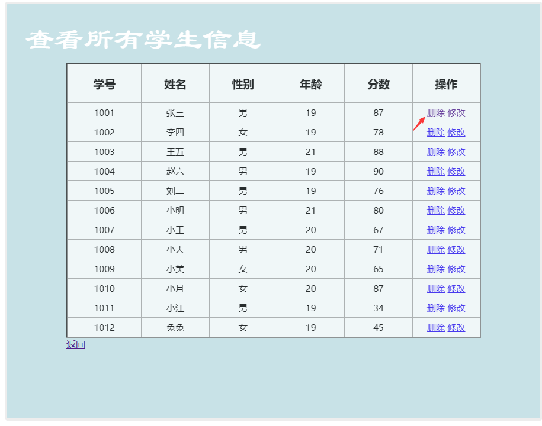

  ```HTML
 <tr>
        <td><%=s.getSno() %></td>
        <td><%=s.getSname() %></td>
        <td><%=s.getSex() %></td>
        <td><%=s.getAge() %></td>
        <td><%=s.getgrades() %></td>
        <td>
          <a href = "DeleteServlet?sno=<%=s.getSno() %>">删除</a>
        </td>
      </tr>
  ```

  设置标签访问DeleteServlet页面，并将学号作为设置参数名为sno

  ```Java
@WebServlet("/DeleteServlet")
public class DeleteServlet extends HttpServlet {

    protected void doGet(HttpServletRequest request, HttpServletResponse response) throws ServletException, IOException {
        String sno = request.getParameter("sno");

        int _sno = 0;
        if(sno != null && !"".equals(sno)){
            _sno = Integer.parseInt(sno);
        }

        StudentService service = new StudentServiceImpl();
        Student stu = service.deleteStudent(_sno);
       
        request.setAttribute("stu", stu);
        request.getRequestDispatcher("ShowAllStudentsServlet").forward(request,response);
    }
}
  ```

  ```Java
@Override
    public Student deleteStudent(int sno){
        return dao.deleteStudent(sno);
    }
  ```

  ```Java
@Override
    public Student deleteStudent(int sno) {
        try {
            Class.forName(DBTools.DRIVER_CLASS);// 加载驱动
            conn = DriverManager.getConnection(DBTools.CONN_STR, DBTools.USRENAME, DBTools.PWD);
            st = conn.createStatement();
            String sqlStr = "delete from student where sno = " + sno;
            System.out.println(sqlStr);
            int result = st.executeUpdate(sqlStr);

        } catch (Exception e){
            e.printStackTrace();
        }
        return null;
    }
  ```

  获取参数名为sno的数据，通过sno搜索到指定的学生信息，执行删除语句，删除完成之后返回空的Student数据，最后重定向回到查询页面并将空数据一起传回去去，前端表上的数据也变为空（即消失）

### 七、退出登陆：

  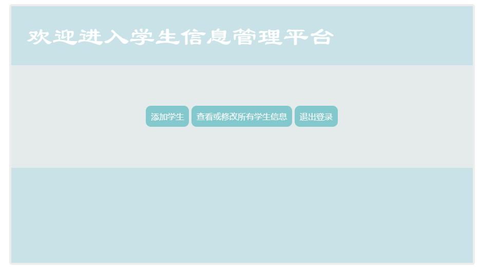

  ```HTML
<a class="a1" href="QuitServlet">退出登录</a>
  ```

  设置a标签访问QuitServlet

  ```Java
@WebServlet("/QuitServlet")
public class QuitServlet extends HttpServlet{

    @Override
    protected void doGet(HttpServletRequest request, HttpServletResponse resp) throws ServletException, IOException {
        HttpSession  session =   request.getSession();
        session.invalidate();
        resp.sendRedirect("index.jsp");
    }
}
  ```

  获取并清空session对象中的所有属性数据内容，重定向回登陆页面

## 四、系统测试


  ### 一、登陆功能

  

  验证账号密码功能，将登陆信息存入session，验证用户类型，不同的用户登陆后的页面不一样。不登录直接访问页面、或是普通用户直接管理员用户会重定向回这个界面并提示登陆

  

  

  ### 二、注册功能

  

  表单填入信息后成功注册后会自动返回登陆页面，并提示注册成功

  

  ### 三、查询功能

- 分页展示所有学生的成绩信息

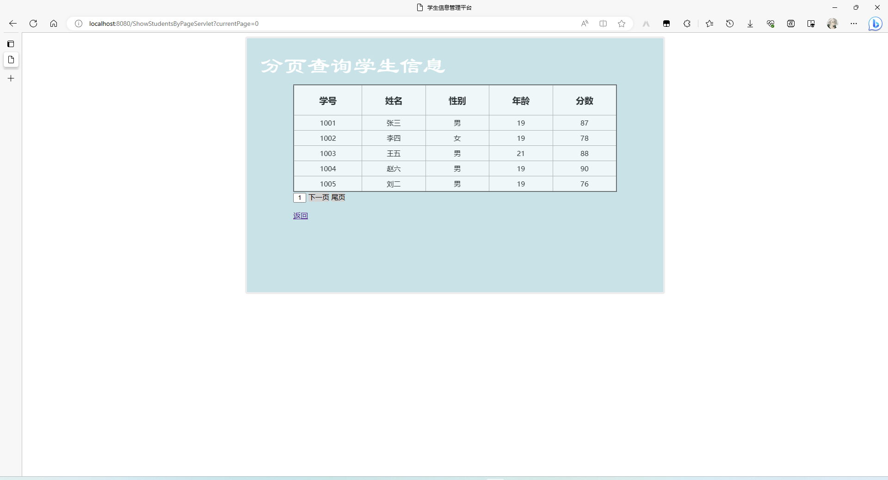

- 展示所有学生的信息


### 四、信息编辑功能

- 删除学生的成绩信息

  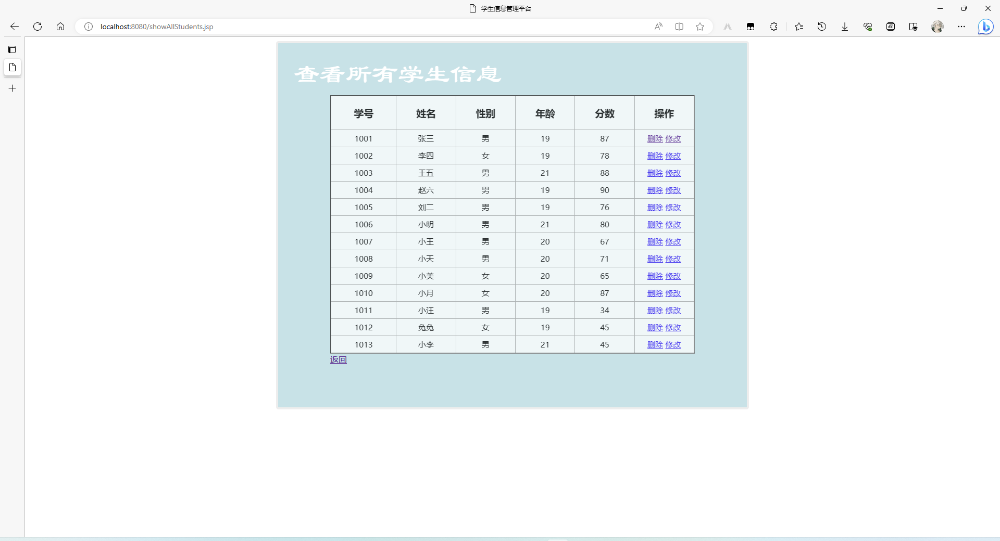

- 添加学生的成绩信息

  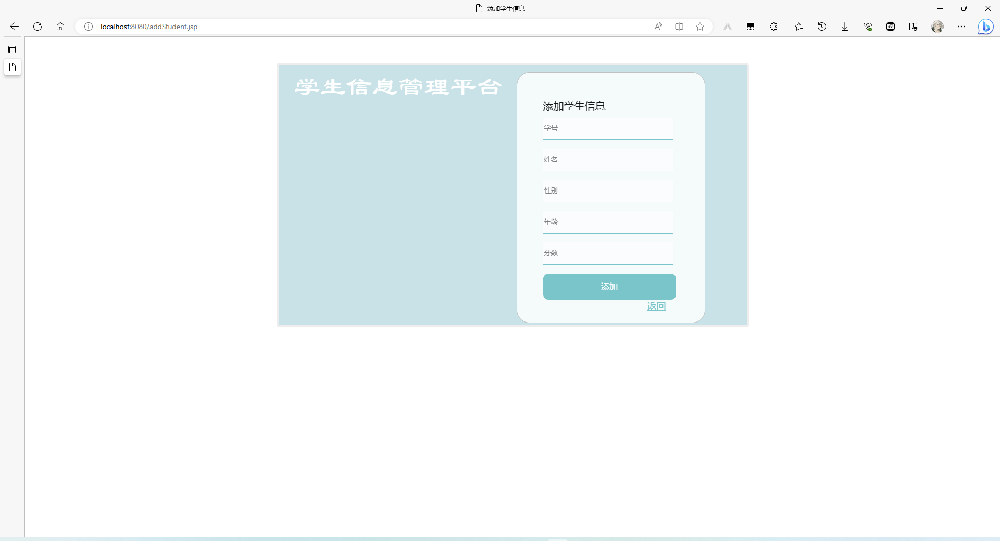

- 修改学生的成绩信息

  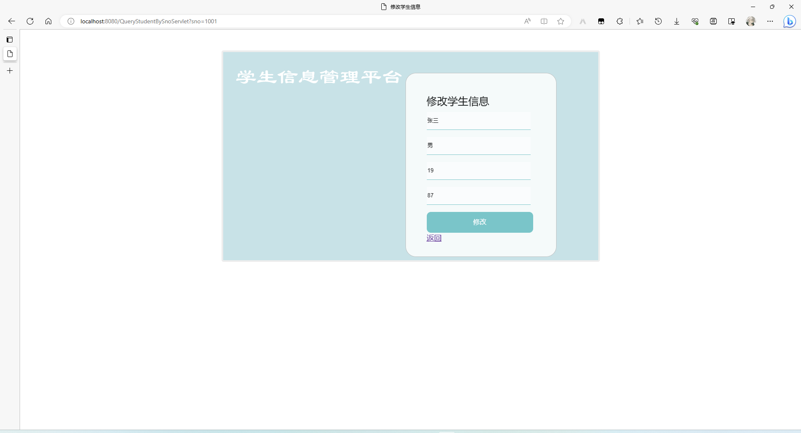

## 五、遇到的问题及解决方法

- maven找不到依赖的插件

  - 解决方法：在maven的`setting.xml`里添加几个镜像：

    ```XML
  <!-- maven官方镜像 -->
    <mirror>
    <id>mirrorId</id>
    <mirrorOf>central</mirrorOf>
    <name>Human Readable Name </name>
    <url>http://repo1.maven.org/maven2/</url>
    </mirror>

    <!-- 阿里云镜像 -->
    <mirror> 
    <id>alimaven</id> 
    <name>aliyun maven</name> 
    <url>http://central.maven.org/maven2</url> 
    <mirrorOf>central</mirrorOf> 
    </mirror>

    <!-- 阿里云镜像 -->
    <mirror> 
    <id>alimaven</id> 
    <name>aliyun maven</name> 
    <url>http://maven.aliyun.com/nexus/content/repositories/central/</url> 
    <mirrorOf>central</mirrorOf> 
    </mirror>

    <!-- junit镜像地址 -->
    <mirror> 
    <id>junit</id> 
    <name>junit Address/</name> 
    <url>http://jcenter.bintray.com/</url> 
    <mirrorOf>central</mirrorOf> 
    </mirror>
  </mirrors>

- 空表单不填数据直接登陆报错500

  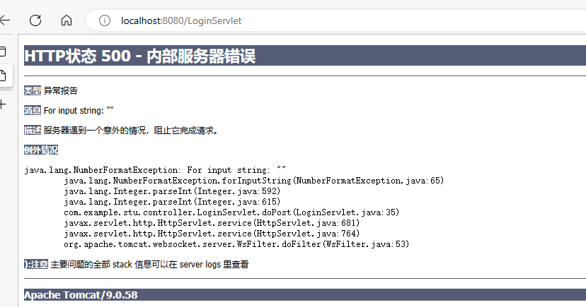

    分析：由于账号数据类型为int，表单获取到的数据类型是String，当包含字符或空时转类型就报错了

    解决方法：在转换类型的语句外面写上`if (uid!=null && !pwd.equals(""))`确保转换的数据是合法的

```java
protected void doPost(HttpServletRequest request, HttpServletResponse response) throws ServletException, IOException {

        StudentService service = new StudentServiceImpl();
        HttpSession session = request.getSession();

        if (session.getAttribute("loginErrorMessage") != null) {
            session.invalidate();
        }
        String uid = request.getParameter("uid");
        String pwd = request.getParameter("pwd");
        System.out.println(uid);
        System.out.println(pwd);

        if (uid!=null && !pwd.equals(""))
        {
            int _uid = Integer.parseInt(uid);
            boolean result = service.login(_uid, pwd);
            boolean type = service.type(_uid, pwd);

            if (result) {

                if (type) {
                    session.setAttribute("login", "type0");
                    response.sendRedirect("main.jsp");
                } else {
                    session.setAttribute("login", "type1");
                    response.sendRedirect("main1.jsp");
                }
            } else {
                System.out.println("账号或密码错误！");
                session.setAttribute("pwdError","账号或密码错误！");
                response.sendRedirect("index.jsp");
            }
        }
        else {
            response.sendRedirect("index.jsp");
        }
    }

}
```

- 用户不登录也能访问操作页面/非管理员也能访问管理员页面

  解决方法：在选择操作的页面使用session信息检检查，如果登陆信息为空则重定向到登陆页面并提示需要登陆的信息，访问管理员页面检测登陆权限信息如果登陆信息不是管理员则重定向回登录页面并提示权限不足的信息：

    ```Java
   <%
    if(session.getAttribute("login") == null) {
      session.setAttribute("loginErrorMessage", "您必须先登录才能访问主页！");
      response.sendRedirect("index.jsp");
    }
    else if(session.getAttribute("login") == "type1")
    {
      session.setAttribute("loginErrorMessage", "您没有权限！");
      response.sendRedirect("index.jsp");
    }
  %>
```java

            if (result) {

                if (type) {
                    session.setAttribute("login", "type0");
                    response.sendRedirect("main.jsp");
                } else {
                    session.setAttribute("login", "type1");
                    response.sendRedirect("main1.jsp");
                }
            }  <%
                if(session.getAttribute("loginErrorMessage") != null){
                                String loginErrorMessage = (String)session.getAttribute("loginErrorMessage");
                out.print(loginErrorMessage);
            }
        %>
```

- 数据库连接jdbc

  处理方法：

    建了一个接口类DBTools用来保存数据库连接用到的信息：

```java
package com.example.stu;

public interface DBTools {
    public static final String DRIVER_CLASS = "com.mysql.jdbc.Driver";//驱动 
    public static final String CONN_STR = "jdbc:mysql://localhost:3306/studentmanager?userSSL=false&serverTimezone=Asia/Shanghai";//链接
    public static final String USRENAME = "root";//数据库账号
    public static final String PWD = "123456";//数据库密码
}
```

在函数里的使用：


```java
Connection conn = null; // 连接对象
Statement st = null; // 语句对象
ResultSet rs = null; // 结果集合对象
@Override
    public boolean login(int uid, String pwd) {
        try {
            Class.forName(DBTools.DRIVER_CLASS);// 加载驱动
        conn = DriverManager.getConnection(DBTools.CONN_STR, DBTools.USRENAME, DBTools.PWD);//连接数据库
        
        st = conn.createStatement();//创建一个语句对象用以执行sql语句
        int count = 0;
        String sqlStr = "select * from login where uid =" + uid + " and pwd = '" + pwd + "'";

        rs = st.executeQuery(sqlStr);// 执行sql语句，完成对数据库中表的数据的增删该查。
        while(rs.next()) {
            count++;
        }
        if(count>0)
            return true;
        else
            return false;

    } catch (ClassNotFoundException e) {
        e.printStackTrace();
    } catch (SQLException e) {
        e.printStackTrace();
    }
    return false;
}
```
- 分页查询

  解决方法，新建一个Page类，设置当前页码、页码总数、单页展示数据数属性

  查询单页语句：用limt限制查询位置和查询数。limit有两个参数，第一个参数表示从第几行数据开始查，第二个参数表示查几条数据。`int startPosition = current * pageSize;//开始位置
String sqlStr = "select * from student limit " + startPosition + "," + pageSize;`

##  六、总结和建议

这个项目纯粹是要用MVC设计模式进行构建，编写调试了很多功能，代码很简单易懂。使用MVC设计模式可以实现Web层的职责解耦，提高代码的可维护性和复用性。

纯粹使用MVC设计模式意味着不依赖于任何第三方的Web框架，而是自己编写Servlet，JSP，等组件来实现MVC的功能。这样做的好处是可以深入理解MVC的原理和思想，对于学习和使用其他基于MVC的Web框架有帮助；但是也有缺点，比如需要编写更多的代码，处理更多的细节，难以适应复杂和变化的需求等。
